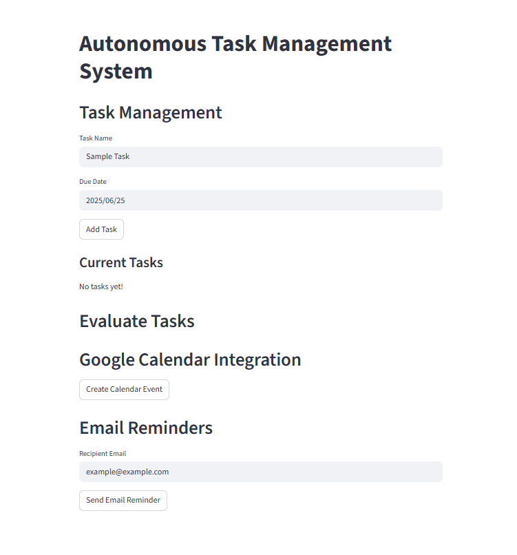

# Autonomous Task Management System (ATMS)

## Overview
The **Autonomous Task Management System (ATMS)** is an **Agentic AI-based** web application built with Streamlit. It integrates seamlessly with **Google Calendar** and **Gmail SMTP** to autonomously manage tasks, create calendar events, and send email notifications. This system uses intelligent agents that can automate tasks like scheduling meetings, setting reminders, and sending email notifications without the need for constant human intervention.
### Features:
- **Task Management**: Add, view, and manage tasks with due dates.
- **Google Calendar Integration**: Create calendar events directly from the app.
- **Email Notifications**: Send email reminders about tasks or events.
- **Dynamic UI**: Interactive interface for adding tasks and scheduling events.

## Tech Stack:
- **Frontend**: Streamlit
- **Backend**: Python, Google APIs
- **Libraries**: 
  - `google-api-python-client` for interacting with Google Calendar API.
  - `smtplib` for sending emails.
  - `pandas` for handling data.

## How to Run the App:

### 1. **Clone the Repository**:
Clone this repository to your local machine.

```bash
git clone https://github.com/your-repo/atms-project.git
cd atms-project
```

### 2. **Set Up the Virtual Environment**:
Create and activate a virtual environment.

```bash
python -m venv .venv
```

For **Windows**:
```bash
.venv\Scripts\Activate.ps1
```

For **Mac/Linux**:
```bash
source .venv/bin/activate
```

### 3. **Install Dependencies**:
Install the required packages from the `requirements.txt` file.

```bash
pip install -r requirements.txt
```

### 4. **Set Up Google Calendar API**:
- Go to [Google Cloud Console](https://console.developers.google.com/).
- Create a project, enable the **Google Calendar API**, and create a **Service Account**.
- Download the **credentials.json** file for your service account.
- Provide the path to your `credentials.json` file in the code where Google Calendar API is being used.

### 5. **Set Up Email Integration**:
- For sending emails via Gmail, you will need to generate an **App Password** if you're using **2-Factor Authentication (2FA)**.
- Replace the placeholder `password` with the **App Password** in the `email_integration.py` file.

### 6. **Run the Application**:
Once the setup is complete, run the app with:

```bash
streamlit run app.py
```

You should now be able to access the app at `http://localhost:8501`.

## User Interface

Here is a screenshot of the UI for managing tasks and integrating Google Calendar.



## Key Components:

### Task Management
- Add tasks with names and due dates.
- View and manage tasks.
- Assign and prioritize tasks using decision-making agents.

### Google Calendar Integration
- Create events directly in Google Calendar from the app.
- Add event details such as **summary**, **start time**, and **end time**.

### Email Notifications
- Send email reminders about tasks to recipients.
- Use Gmail's SMTP server to send notifications.

## Troubleshooting:
- **Google Calendar API**: If you receive a `403` error, ensure that the Google Calendar API is enabled in the Google Cloud Console and that the service account credentials are set up correctly.
- **SMTP Authentication**: If you encounter an SMTP authentication error, ensure that you are using an **App Password** if your Google account has **2FA** enabled.

